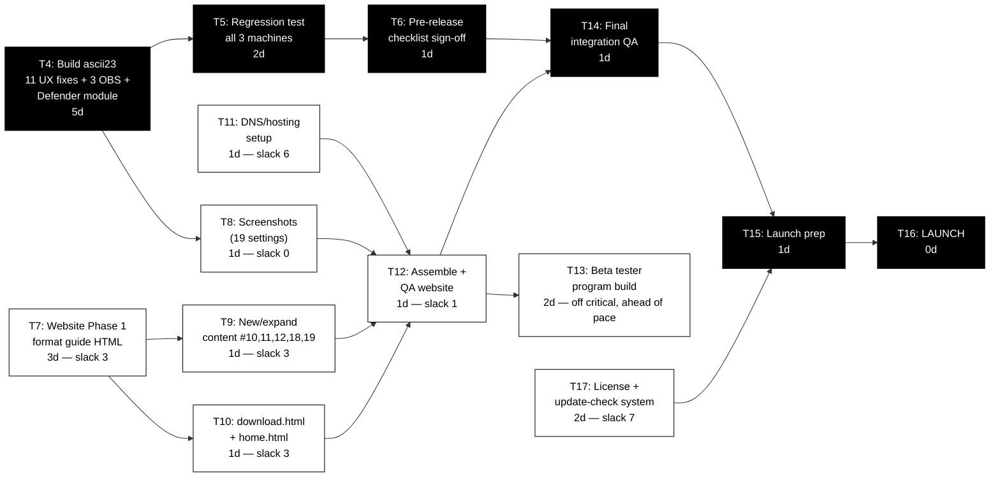

<!-- Dated: 2026-07-03 -->
# GatewayGuard — Critical Path Method (CPM) Schedule
**Baseline date:** 03-Jul-2026 | **Target launch:** 01-Sep-2026 (60 calendar days out)
**Current build:** ascii22 (complete) → ascii23 (in progress) | **LLC:** Filed/FedExed, Noncommercial Registered Agent confirmed
**Revision 4 (03-Jul-2026):** T2 and T3 confirmed complete (Dell Pro setup + ascii22 clean baseline run, 30-Jun-2026). ascii23 scope has grown substantially since Revision 3 — from 3 general Pro-fixes to 11 specific UX fixes (UX-01 to UX-11), 3 field observations (OBS-01 to OBS-03), plus two new items from today's session: the Defender Follow-Up Module (offline scan confirmation, Protection History walkthrough, Malwarebytes detection/redirect) and a new license/update-check design. T4 duration revised upward accordingly.

---

## ASSUMPTIONS (flagged for verification)

- ~~Dell Latitude 5430 arrival~~ — **RESOLVED**, Machine on-hand since 30-Jun-2026.
- ~~T2 (Pro initial setup)~~ — **RESOLVED**, complete.
- ~~T3 (Run ascii22 on Dell)~~ — **RESOLVED**, complete 30-Jun-2026. Result: clean vanilla Win 11 Pro baseline, Malwarebytes scan clean (<1 min), Defender offline scan clean. Good test baseline established.
- Durations are working days (Mon–Fri), not calendar days.
- Tasks already complete (LLC filing, ascii22 build/test, SANDY/IdeaPad first-pass testing, marketing assets, coding standards doc, family presentation v3 + companion sheet + community flyer, GatewayGuide/Profile instructions) are excluded from the network — sunk cost, not float.
- Beta Tester Program and Website Phase 2/3 remain OFF the critical path, scheduled into available slack.
- **New:** License/update-check system (T17) is new scope, not previously in the CPM. It's tied to the Annual Updates ($12.99/yr) revenue tier, so while it's not a build-blocking dependency, it should complete before T15 (launch prep) so it can appear correctly in launch marketing.

---

## TASK TABLE

| ID | Task | Dur (days) | Predecessors | ES | EF | LS | LF | Slack | Critical? |
|----|------|:--:|------|:--:|:--:|:--:|:--:|:--:|:--:|
| T1 | ~~Dell Latitude 5430 arrives~~ | — | — | — | — | — | — | — | **COMPLETE 30-Jun-2026** |
| T2 | ~~Win11 Pro initial setup + full Windows Update~~ | 1 | — | — | — | — | — | — | **COMPLETE** |
| T3 | ~~Run ascii22 on Dell (Pro), clean baseline confirmed~~ | 1 | T2 | — | — | — | — | — | **COMPLETE 30-Jun-2026** |
| T4 | Build ascii23 — 11 UX fixes (UX-01–UX-11), 3 field observations (OBS-01–OBS-03), integrate Defender Follow-Up Module | **5** *(was 3)* | T3 | 0 | 5 | 0 | 5 | 0 | **YES** |
| T5 | Regression test ascii23 on all 3 machines (SANDY, IdeaPad, Dell) | 2 | T4 | 5 | 7 | 5 | 7 | 0 | **YES** |
| T6 | Pre-release checklist sign-off (per CodingStandards.md) | 1 | T5 | 7 | 8 | 7 | 8 | 0 | **YES** |
| T7 | Website Phase 1: format existing guide content → HTML (13 pages) | 3 | — | 0 | 3 | 3 | 6 | 3 | No |
| T8 | Screenshots — all 19 settings (must reflect FINAL ascii23 UI) | 1 | T4 | 5 | 6 | 5 | 6 | 0 | No (ties critical) |
| T9 | New/expanded content — settings #10,11,12,18,19 | 1 | T7 | 3 | 4 | 6 | 7 | 3 | No |
| T10 | Build download.html + index.html (home) | 1 | T7 | 3 | 4 | 6 | 7 | 3 | No |
| T11 | DNS/hosting setup (GitHub Pages) | 1 | — | 0 | 1 | 6 | 7 | 6 | No |
| T12 | Assemble + QA Website Phase 1 (all links, nav, mobile check) | 1 | T8, T9, T10, T11 | 6 | 7 | 7 | 8 | 1 | No |
| T13 | Beta tester program build (signup form, screening checklist) | 2 | T12 | 7 | 9 | — | — | — | **Off critical — informal recruiting already ahead of schedule (Erica identified 02-Jul; tracker built)** |
| T14 | Final integration QA — tool ↔ website link checks, full end-to-end run | 1 | T6, T12 | 8 | 9 | 8 | 9 | 0 | **YES** |
| T15 | Launch prep — LLC bank account, domain transfer to LLC, final marketing review | 1 | T14, T17 | 9 | 10 | 9 | 10 | 0 | **YES** |
| T16 | **LAUNCH** | 0 | T15 | 10 | 10 | 10 | 10 | 0 | **YES** |
| T17 | **NEW:** Build license/update-check system — hardware-fingerprint validation, own-hosted version manifest, gated by Annual Update paid status | 2 | — | 0 | 2 | 7 | 9 | 7 | No — must finish before T15 |

---

## CRITICAL PATH

**T4 → T5 → T6 → T14 → T15 → T16**

Length: **10 working days** ≈ **14 calendar days** from 03-Jul-2026 → build/test completion around **~17-Jul-2026**.

Float against the 01-Sep-2026 deadline is now roughly **~46 calendar days** (down slightly from ~49 in Revision 3, entirely because T4's duration grew from 3 to 5 days to reflect its real scope). Still a comfortable cushion.

---

## CPM NETWORK CHART

**Black nodes = critical path (zero slack).** T8 (screenshots) is technically white above but carries zero slack in the table — its only float comes from T12's 1-day cushion, so treat it as critical in practice.

---

## SLACK ALLOCATION (how to use the ~46-day buffer)

| Use of slack | Recommendation |
|---|---|
| Beta Tester Program (T13) | Formal build in Days 7–9; informal recruiting already underway (Erica, family candidates) — ahead of pace |
| License/update-check system (T17) | Days 0–2, parallel to T4 — low risk, but must land before T15 since it's tied to a paid revenue tier |
| Website Phase 2 (compatible.html, beta.html, glossary.html) | Days 10–15 |
| Website Phase 3 (Firefox addendum, printable reference, changelog) | Days 15–20 |
| Press outreach (prerequisite for named-competitor marketing per moratorium) | Begin Days 10+, parallel — has its own external timeline |
| Buffer for ascii23 → ascii24 if further Pro-testing issues surface | Absorbed by existing float, though margin is 2 days thinner than Revision 3 |
| Malwarebytes automation limitation | No officially documented cmdlet exists to trigger a scan (unlike Defender's `Start-MpWDOScan`) — plan to launch the app to the scan screen, not a fully silent scan. Set this expectation now rather than during testing. |

---

## RISK FLAGS

1. ~~Dell Latitude 5430 ETA~~ — **RESOLVED.** In hand as of 30-Jun-2026.
2. ~~T3 (run ascii22 on Dell)~~ — **RESOLVED.** Clean baseline confirmed 30-Jun-2026.
3. **T4 scope creep — CONFIRMED, not just a risk.** Original estimate (3 days, general Pro-specific fixes) has grown to 11 named UX fixes, 3 field observations, plus today's Defender Follow-Up Module and license-system design work. Duration revised 3→5 days this revision. If additional issues surface during T5 regression testing, expect this to compress the ~46-day float further — worth re-running this CPM again once T4 actually closes out, to confirm the 5-day estimate held.
4. **T17 is new, unscoped-until-today work.** Hardware-fingerprint licensing and an independent update-check (NOT hooked into Windows Update itself — that's not technically available to third-party tools) still need to be built and tested. Low schedule risk given slack, but flagged since it's revenue-critical for the Annual Updates tier.
5. **T8 (screenshots)** still effectively zero-slack — don't let ascii23's UI drift after screenshots are taken, or they'll need to be redone.
6. **Malwarebytes scan automation is limited by design**, not by GatewayGuard's implementation — no official scan-trigger cmdlet exists. This needs to be reflected accurately in any marketing language about "automated" scanning (don't overclaim silent automation for the Malwarebytes leg specifically — Defender's offline scan IS fully automatable, Malwarebytes is not).
7. **T12 "QA all links"** still assumes Phase 1 MVP scope (guide hub + 19 setting pages + download + home) — if scope creeps toward the full 44-page WebsitePrePlan before launch, T7/T9/T10 durations are understated.

---

*Generated 03-Jul-2026 (Revision 4). Re-run this CPM once ascii23 (T4) actually closes out — that's the single input most likely to move every downstream date, given how much its scope has already grown once.*
